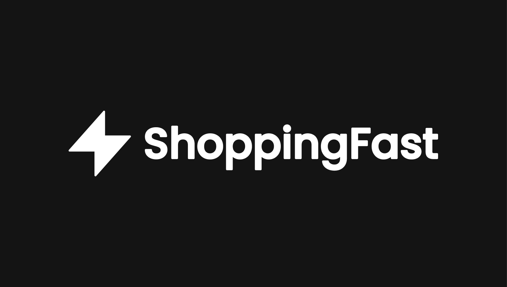

<div align='center'>
  <h1>🤖 Shopping Fast | Web Scrapper 💻</h1>
  
</div>

## 📕 Acerca de este proyecto

Un sencillo web scrapper que obtiene información de una lista de productos de la página de coppel.com.

## 🚀 ¿Como usar?

🚨 _Es necesario usar la versión de node **v18.13.0**._

Primero clona el repositorio desde GitHub:

```shell
git clone https://github.com/JoseLuria/shopping-fast-scrapper.git
```

Muévete a la carpeta del proyecto:

```shell
cd shopping-fast-scrapper
```

Instala las dependencias con el siguiente comando:

```shell
npm install
```

Inicia la aplicación de **desarrollo** usando el siguiente comando:

```shell
npm run dev
```

## ⚙️ Esta aplicación fue construida usando las siguientes tecnologías

- [TypeScript](https://www.typescriptlang.org/)
- [Node.js](https://nodejs.org/es/)
- [Zod](https://zod.dev/)
- [Cheerio](https://www.npmjs.com/package/cheerio)
- [Sharp](https://www.npmjs.com/package/sharp)
- [Uuid](https://www.npmjs.com/package/uuid)
- [Axios](https://www.npmjs.com/package/axios)
- [Standard](https://standardjs.com/)
- [ESLint](https://www.npmjs.com/package/eslint)
- [Prettier](https://www.npmjs.com/package/prettier)

## 📄 Licencia

[MIT](https://opensource.org/licenses/MIT)
